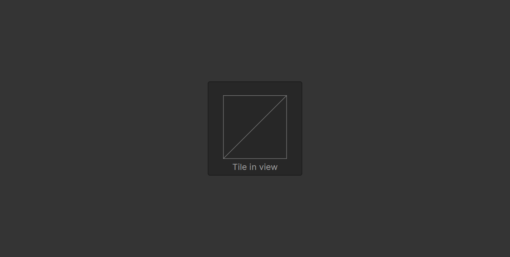
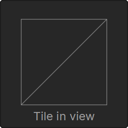

## Malfunctionning Previews

A reproducible example for the preview functionality of the Avalonia vscode extension

See [#63](https://github.com/AvaloniaUI/AvaloniaVSCode/issues/63) for context.

Additional log when previewing a view for the first time after opening vscode can be found here [AdditionalLogs.txt](https://github.com/Mrcubix/MalfunctionningPreview/blob/master/AdditionalLogs.txt)

## What the view look like (dotnet run)

## What the TemplatedControl look like (dotnet run)

  

